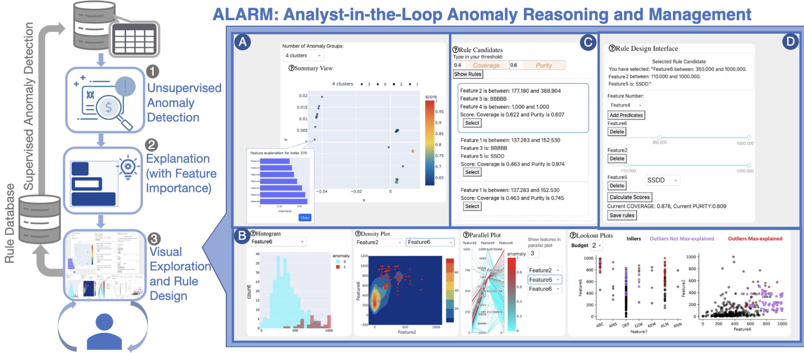

# ALARM: Analyst in the Loop Anomaly Reasoning and Management

## Guidance of Running

### Configuration Installation
1. cd config
2. make sure your conda version is compatible with python version = 3.9
3. conda env create -f env.yml (creates a environment called iarm)
4. source activate iarm

(if the input data file is not .txt/ .csv with "index" as the indexing_col, please reformat it using
the jupyter notebook data/process_data_add_index.ipynb)

### Running Xstream Detection 
5. cd ..
6. cd xstream
7. python xstream_with_explanation.py ../parameters.json

check whether you have "/data/dataset_folder/anomaly_scores.txt",
"/data/dataset_folder/concatenate_result.txt",
"/data/dataset_folder/explanations.txt" in the same directory as your input data file.

### Running Xpacs(Offline) 
8. cd ..
9. cd xpacs_offline
10. python xpacs.py ../parameters.json

check whether you have "xpacs_offline/result/dataset_name/" directory with clusters and rules in .txt formats

### Running Lookout(Offline)
11. cd ..
12. cd lookout
13. python lookout.py ../parameters.json begin_index, end_index
    the begin_index and end_index is the beginning clusters you want and ending clusters you want, I use this to speed up the process on the server.
    for example: python lookout.py lookout_parameters.json 2 4 

check whether you have "assets/dataet_name" with lookout plots

### Running interface
14. python myapp.py
15. open the browser and type into the addresses that myapp.py provided

### Parameters of parameters.json file
"projection": true, boolean flag, use Xstream's projection or not
"dataset_name": "ids", str, dataset folder name
"explain": true, boolean flag, use Xstream's explanation or not
"explain_method": "random_walk", str, which Xstream's explanation method is used here (random walk in our paper)
"projdim": 60, int, number of projection dimension with Xstream.
"nchains": 300, int, number of half space chains
"depth": 20, int, each chain's detph
"input_file": "../data/ids/input_data.txt", input data file place
"output_path": "../data/ids", output result directory
"output_file": "../results/ids/saved_rules.txt", output file name
"has_label": true, whether the input_file has anomaly labels (last column should be anomaly labels of 0 or 1)
"topk": 300, int, how many anomalies can be explained
"cluster_num": 10, int, the maximum number of groupings of anomalies
"use_label": true, boolean flag, whether to use anomaly labels and explained the existing anomalies
"top_features": 10, int, the maximum number of features to use in Xpacs and Lookout
"load_saved": false, boolean flag, whether to use saved results in Lookout (default False)
